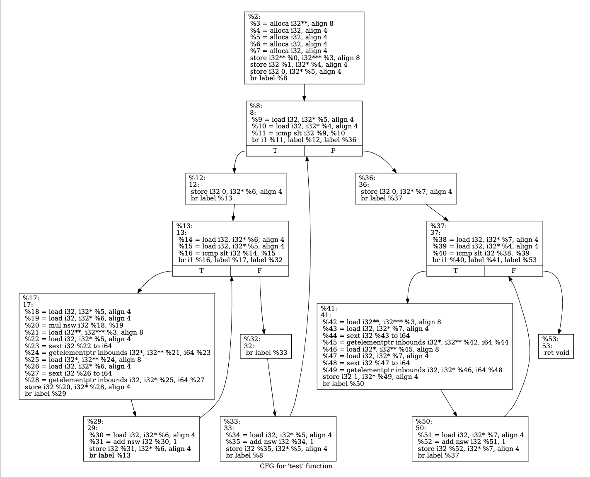
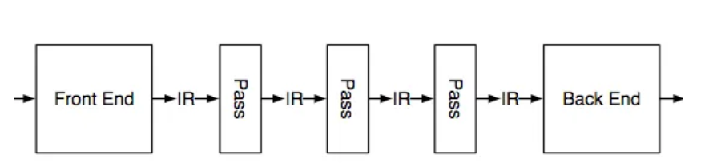
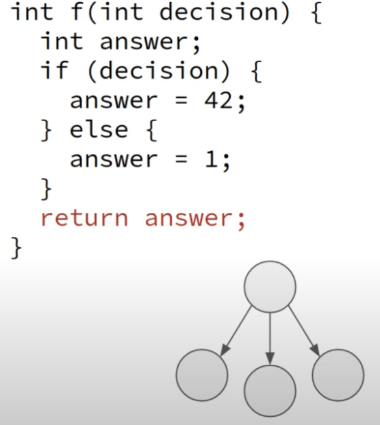
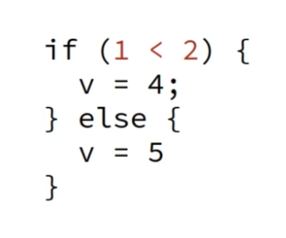
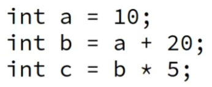
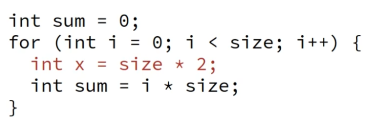

# 過程
## 1. 使用clang做parsing

```
clang -S -emit-llvm file.c -o file.ll
```
- 可以將hello.c 轉成llvm ir(intermediate representation)

## 2. 用llvm-tool **Dot (graph Description language)** 生成file.ll的流程圖 
```js
opt -dot-cfg file.ll -disable-output //cfg stand for control flow graph
```
- 會生成一個檔案叫.main.dot 這個檔案為digraph描述檔 可用graphviz視覺化，基本上就是一個流程圖。

## 3. 用llvm-tool llc(LLVM Static Compiler) 將IR 轉為 target assembly code
* target 可以為
    * x86
    * arm
    * mips
    * etc
```
llc file.ll -march=x86 -o file.x86
```
- 其中march唸作 **m arch**


# The LLVM Intermediate Representation
## 1. 使用-Xclang -disable-O0-optnone來禁用函數優化，因為想要在opt時才做優化。
```
clang -Xclang -disable-O0-optnone -S -emit-llvm file.c -o file.ll
```
## 2. 優化
```
opt -S -mem2reg f.ll -o f opt.ll
```
其中mem2reg意思是將memory中的數值放到register中，如此一來數值在passing時會比較快

## 3. 結論
我有試過如果在clang時沒有加入-Xclang -disable-O0-optnone，則opt在mem2reg時會沒有用處

# Program Visualization using LLVM
## 1. 在ubuntu安裝 **graphviz**
```
sudo apt install graphviz
```
## 2. 視覺化
-
    ```js
    clang -S -emit-llvm file.c -o file.ll 
    
    - opt -dot-cfg file.ll //會顯示basic block裡的IR
    //or
    - opt -dot-cfg-only file.ll // 只會顯示流程
    //or
    - opt -dot-dom-only file.ll // dom stand for Dominator Tree
    
    // 還有很多各種視覺化的工具 可以在cmd中使用
    opt --help | grep dot
    // 來查看所有的指令參數
    ```
-
    ```js
    dot -Tpdf .test.dot -o test.pdf //test是file.c裡的一個func，-Tpdf也可以是-Tpng
    ```
    這行會將.test.dot這個graph description轉成pdf，如下
    - opt -dot-cfg file.ll
        
    - opt -dot-cfg-only file.ll
        
    - graph介紹
        - vertex : Basic blocks
        - edge : Program flow

# Introduction to LLVM Passes
## Passes可以當作是IR input到opt時，opt會分成很多個階段，而每個階段就是一個pass


## LLVM大致有以下passes種類
- Loop Pass
- Function Pass
- Module Pass
- Call Graph SCC Pass
- Region Pass
- Machine Function Pass

Example:
- Analysis Examples:
  - Range Analysis 如分析for loop的range
  - Scalar Evolution 如induction variable
  - Dominator Tree
- Transformations Examples
  - Dead Code Elimination
  
  - Constant Propagation
  
  - Loop-invariant code motion 將迴圈內部不受循環影響的語句或表達式移到循環體之外，和此條目提到的迴圈不變式無關係。
  

# Writing an LLVM Analysis (part 1)
## Project Structure
```
├── CMakeLists.txt
├── examples
│   └── foo.ll
├── include
│   └── AddConst.h
├── lib
│   ├── AddConstAnalysis.cpp
│   ├── AddConstPass.cpp
│   ├── AddConstPlugin.cpp
│   └── CMakeLists.txt
├── README.md
└── tool
    ├── CMakeLists.txt
    └── Main.cpp
```
## 步驟
- 修改CMakeList.txt檔裡的 **LLVM_INSTALL_DIR**
- Config
    ```sh
    cmake -B build/ .
    ```
- Build : 
    ```sh
    cd build
    cmake --build .
    ```
- build後的結果會在build/lib下，檔名為libAddConst.so

- 鍊結 build/lib/libAddConst.so 給opt，也可以說是將libAddConst.so當作plugin加入llvm passes，然後用examples/foo.ll當作範例
    ```ps
    /usr/lib/llvm-10/bin/opt \
    -load-pass-plugin build/lib/libAddConst.so \
    -passes="print<add-const>" \
    -disable-output examples/foo.ll 
    ```
    ```console 
    output:
    =============================================
    || foo ||
    =============================================
    %c = add i32 1, 2
    %d = add i32 3, 4
    =============================================
    ```
這個練習主要是讓我熟悉plugin的基本操作，更加理解passes的客製化流程。還有一些make的用法。

Note :
- 在vscode裡，想加入include pass的話，要在根目錄新增.vscode/c_cpp_properties.json，並且將include的資訊放在c_cpp_properties.json裡。


# Assign-practice
寫一個將IR輸出的pass
- idea:在IR中，大致上可以分成
    - module
    - basic block
    - instruction
- 加入
    - AddConst.h
        - struct AddModuleAnalysis : public llvm::AnalysisInfoMixin<AddModuleAnalysis>
        - struct AddModuleIrPrinter : public llvm::PassInfoMixin<AddModuleIrPrinter>
    - AddConstPlugin.cpp 註冊pass
        - PB.registerAnalysisRegistrationCallback(registerModuleAnalyses)
        - PB.registerPipelineParsingCallback(registerModulePipeline)
    - AddConstAnalysis.cpp
        - PreservedAnalyses AddModuleIrPrinter::run(Module &M,ModuleAnalysisManager &MAM) 
        - AddModuleAnalysis::Result AddModuleAnalysis::run(Module &M,ModuleAnalysisManager &MAM)
- 流程
    - 分析模塊
        這個步驟將ir指令加入到AddInsts裡
    - PreservedAnalyses
        對分析後的結果做處理
- Note:
    - 對register callback的參數(func)不熟，需更熟悉流程。
- 結果


# Writing a LLVM-based tool
大致上在講如何用剛剛自己編譯的./build/bin/addconst 這個executable file(可執行檔)達成以上的目的，而能達成以上目的的關鍵在./tool/main.cpp。
``` bash
#在 ./build資料夾下執行
bin/addconst ../examples/foo.ll -o ../examples/bar.ll
```
這個意思是，原本我們使用cmd中opt這個指令，但在這裡我們自己寫了一個cpp程式，並建構可執行檔取代opt，且他們在目前的功能之下，有著同樣的效果。

# LLVM Loops
## 此章節大致上講解了一個用來分析loop的工具，lif(https://github.com/lac-dcc/lif)。
## loop的架構大致可以分為
- Header（迴圈頭）：迴圈的頭（header）是迴圈結構的進入點，也是迴圈的起始點。它通常是迴圈的第一個基本塊（basic block），也是迴圈控制流的進入點。所有的迴圈迭代都從頭部開始。

- Latch（迴圈尾）：迴圈的尾（latch）是迴圈結構的結束點，也是迴圈的迭代點。它通常是迴圈的最後一個基本塊，迴圈控制流從頭部進入並最終回到尾部。在每次迭代結束時，控制流都會回到迴圈尾，並根據迴圈條件進行決策。

- Exiting Blocks（退出塊）：退出塊是指從迴圈中退出的基本塊。在迴圈中，可能會有多個基本塊可以退出迴圈，而這些基本塊被稱為退出塊。當迴圈條件不滿足時，控制流會離開迴圈並進入這些退出塊。退出塊通常是在迴圈尾部之外的基本塊。

latch跟exiting block有點像，舉例來說
```
do{
    if( i==8 )break;
    i++;
}while(i<10)
```
- if( i==8 )break ---> Exiting Blocks
- while(i<10) ---> Latch

# LLVM Metadata
## intro
LLVM metadata是一種將附加信息附加到LLVM IR（Intermediate Representation）代碼的方法。這些元數據可以用於註釋代碼的各個方面，例如源位置(~/Desktop/file.c)、調試信息、優化提示等等。
<!-- ## 表示方法
```
define i32 @foo(i32 %x) {
  ; ...
  ret i32 %result
}

!0 = metadata !{inlinehint}
```
也可以是named metadata
```
!IDILocalVariable (name: "argc", arg: 1, scope: !34, file: !1,
line: 11, type: !10)
``` -->
## metadata format

- !{\<data>}：這是最簡單的元數據格式，其中 \<data> 可以是任何 LLVM IR 中有效的常量或常量表達式。例如 ```!{i32 42}``` 表示一個包含整數值 42 的元數據節點。

- !{\<tag>, \<data>}：這種格式將一個標記（tag）與一個數據（data）相關聯。標記可以是預定義的字符串，例如“dbg”、“nonnull”等，也可以是自定義字符串。數據可以是任何 LLVM IR 中有效的常量或常量表達式。例如， ```!{nonnull, i32* %ptr}``` ，nonnull 是標記，i32* %ptr 是與之相關聯的數據。它表示 %ptr 是一個非空指針，可以用於提高編譯器優化的精度。


- !{\<tag>, \<data1>, \<data2>, ...}：這種格式允許將多個數據與同一個標記相關聯。例如，```!{dbg, i32 3, i32 4, i32 5}``` 表示一個調試信息元數據節點，其中標記為“dbg”，數據包括三個整數值。

- !\<id>：這種格式是對其他元數據節點的引用。例如， ```!0``` 表示對 ID 為 0 的元數據節點的引用。

- !\<id> = metadata \<type> \<data>：這種格式定義了一個新的元數據節點，其 ID 為 <id>。類型（\<type>）指定了元數據的類型，例如``` !DILocation``` 表示調試位置信息。數據（\<data>）是與元數據節點相關聯的實際值。例如，``` !5 = metadata !{i32 0, i32 0, metadata !6, metadata !7}``` 表示一個元數據節點，其 ID 為 5，類型為 ```!DILocation``` ，數據包括兩個整數值和兩個元數據引用。

- example : ***Name Metadata**
    ```llvm
    !0 = !{!"Zero"}
    !1 = !{!"One"}
    !name = !{!0,!1}
    ```

## Metadata vs Type Metadata
- Metadata \
    metadata 用於描述 LLVM IR 中的指令，例如標記非空指針（nonnull），或者在調用函數時傳遞的參數屬性（attributes）。metadata 通常是一個指向元數據節點的指針，該節點可以包含標記和相關聯的數據。
    ```cpp
    define void @foo(i32* %ptr) !nonnull !1 {
        ; ...
    }
    !1 = !{nonnull}
    ```
    在這個範例中，!nonnull 是一個 metadata 節點，用於標記 @foo 函數的第一個參數 %ptr 是一個非空指針。
- Type metadata \
    type metadata 用於描述 LLVM IR 中的類型。**每個類型都有一個唯一的 type metadata**。type metadata 可以包含類型的名稱、大小、對齊方式以及其他類型特定的屬性。在 LLVM IR 中， type metadata 節點通常是指向一個具體類型的指針，例如 **i32、float 或 struct**。這些 type metadata 可以用於定義和操作不同的數據類型，例如在定義全局變量時，需要指定變量的類型，或者在函數聲明中指定參數和返回值的類型。
    ```cpp
    %struct.Person = type { i8* , i32 }
    define void @foo(%struct.Person* %person) {
        ; ...
    }
    ```
    上面這段翻成cpp會變成以下
    ```cpp
    #include <stdio.h>
    struct Person {
        char* name; // 8bit 對應到 i8*
        int age; // 32bit 對應到 i32
    };
    void foo(Person* person) {
        ; ...
    }
    ```
    在這個範例中，%struct.Person 是一個結構體的類型，它包含一個指向 i8 類型的指針和一個 i32 類型的整數。 type metadata 節點 %struct.Person 用於描述這個類型，並且可以在定義全局變量或函數聲明時使用。在函數定義中，%struct.Person* 是一個指向結構體的指針，用於操作這個類型的數據。

- 整理:
    - metadata
        - is not a value
        - does not have a type
    - type metadata
        - reference by function calls
## Source Code Class for handling metadata
- DICompileUnit：用於描述源文件的編譯信息。
- DISubprogram：用於描述函數的調試信息，包括函數名稱、參數、局部變量等。
- DILexicalBlock：用於描述代碼塊（block）的調試信息，即源代碼中的花括號 {} 包圍的區域。
- DILocalVariable：用於描述函數中的局部變量的調試信息，包括變量名稱、類型等。
- DIGlobalVariable：用於描述全局變量的調試信息，包括變量名稱、類型等。
- DIExpression：用於描述調試器需要執行的表達式，以計算一個變量的值，例如取地址、加減運算等。
- C++ example: 
    ```cpp
    // 定義 DISubprogram 元數據
    DISubroutineType *funcType = builder.createSubroutineType(builder.getOrCreateTypeArray(None));
    DISubprogram *func = builder.createFunction(compileUnit, "foo", "", file, 1, funcType, false, true, 1);
    ```


# Recovering Source Information


# Tracking Variables in LLVM IR
## llvm debugging
Debugging 是一個非常重要的任務，它用於幫助開發人員識別並解決程式碼中的錯誤。這些錯誤可能包括：
- 編譯錯誤：在將原始程式碼轉換為 LLVM IR 時出現錯誤。
- 運行時錯誤：在執行 LLVM IR 時出現錯誤。
- 邏輯錯誤：程式碼的行為不符合預期。

而通常debugging任務需具備以下特性:
- Should have little impact
- Unaware of semantics 

    不需要知道source level的語意，因為llvm本來就支援不同種類的語言 
- Works with any language
- Compatible with debuggers

    需與傳統machine code level debugger相容，ex. GDB
    
    ```GDB 是一個開源的命令行調試器，全稱是 GNU Debugger。它可以用來調試 C、C++、Ada、Objective-C、Fortran 和其他一些程式語言的程式碼，並且支援多種平台，如 Linux、UNIX 和 Windows。```

## Debugger information intrinsics
在 LLVM 中，Debugger information intrinsics 是一組用於生成調試資訊的指令集。它們是在 LLVM IR 中插入的特殊指令，用於指示調試器在執行程式碼時如何提供相關的調試資訊，例如變數名稱、型別、作用域、源碼行號等等。
- 使用llvm.dbg當prefix，如
    - llvm.dbg.declare：
        用於聲明(declare)一個 **變數** 的 調試資訊(debugging information)，例如變數的名稱、型別、作用域(scope)等等。
        ``` llvm
        %var = alloca i32;表示要為一個 i32 型別的變數分配記憶體空間，並將其地址儲存在 %var 中。
        %dbg = metadata !{i32 123, metadata !"my_var", metadata !DIExpression()}
        call void @llvm.dbg.declare(metadata !DILocalVariable(%dbg), metadata !DIExpression(), %var)
        ```
    - llvm.dbg.value：
        
        用於描述一個 **值** 的調試資訊，例如變數的值、類型等等。
        ```llvm
        %val = load i32, i32* %ptr;表示要載入（load）一個 i32 型別的值，該值的位置儲存在 %ptr 所指向的記憶體位址中，並將載入的值儲存在 %val 變數中。
        %dbg = metadata !{i32 456, metadata !"my_val", metadata !DIExpression()}
        call void @llvm.dbg.value(metadata !DILocalVariable(%dbg), metadata !DIExpression(), %val)
        ```
    - llvm.dbg.region.start 和 llvm.dbg.region.end：
        
        用於描述一段程式碼區域的調試資訊，例如區域的起始位置、結束位置等等。
        ```llvm
        %dbg_start = metadata !{i32 0, i32 0, metadata !DIFile("my_file.c"), metadata !"my_func", i32 1, metadata !{}}
        call void @llvm.dbg.region.start(%dbg_start)
        ; code goes here
        ; code goes here
        %dbg_end = metadata !{i32 0, i32 0, metadata !DIFile("my_file.c"), metadata !"my_func", i32 2, metadata !{}}
        call void @llvm.dbg.region.end(%dbg_end)
        ```
- 在 ```llvm-tutorial/llvm-course/llvm-metadata/Class 3/TrackingPass``` 此練習中有處理dbg info的程式碼，如被override的llvm::runOnModule()裡有抓取DIlocalVariable。


# TBAA Metadata
