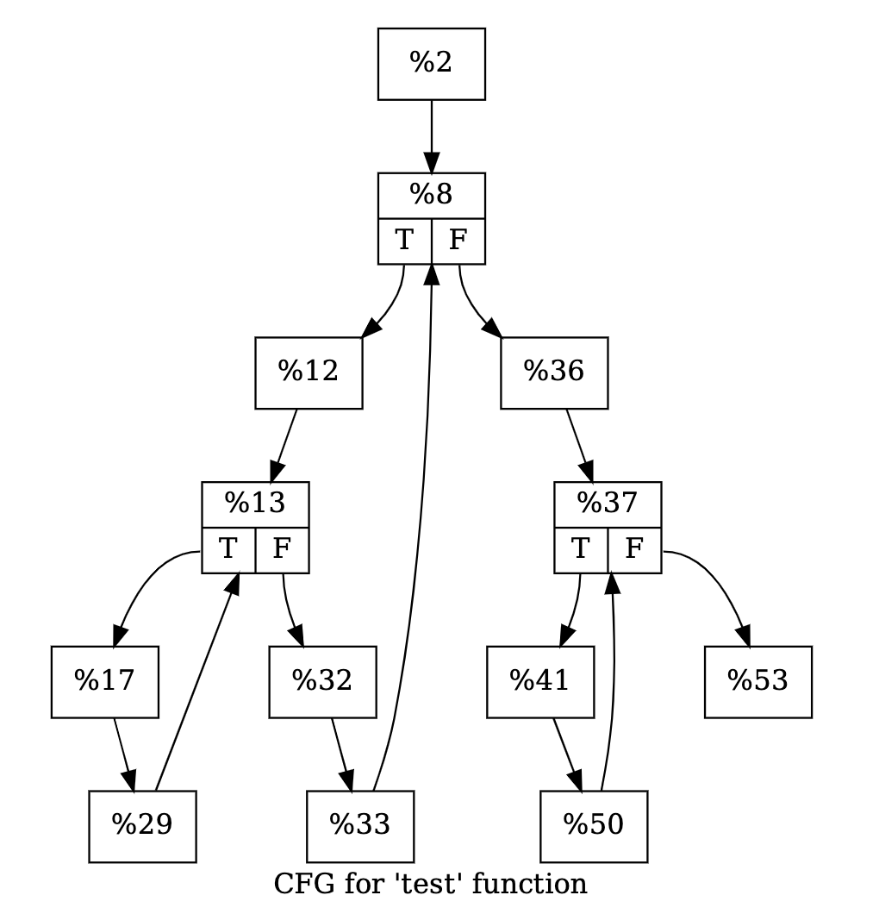

# 過程
## 1. 使用clang做parsing

```
clang -S -emit-llvm file.c -o file.ll
```
- 可以將hello.c 轉成llvm ir(intermediate representation)

## 2. 用llvm-tool **Dot (graph Description language)** 生成file.ll的流程圖 
```js
opt -dot-cfg file.ll -disable-output //cfg stand for control flow graph
```
- 會生成一個檔案叫.main.dot 這個檔案為digraph描述檔 可用graphviz視覺化，基本上就是一個流程圖。

## 3. 用llvm-tool llc(LLVM Static Compiler) 將IR 轉為 target assembly code
* target 可以為
    * x86
    * arm
    * mips
    * etc
```
llc file.ll -march=x86 -o file.x86
```
- 其中march唸作 **m arch**


# The LLVM Intermediate Representation
## 1. 使用-Xclang -disable-O0-optnone來禁用函數優化，因為想要在opt時才做優化。
```
clang -Xclang -disable-O0-optnone -S -emit-llvm file.c -o file.ll
```
## 2. 優化
```
opt -S -mem2reg f.ll -o f opt.ll
```
其中mem2reg意思是將memory中的數值放到register中，如此一來數值在passing時會比較快

## 3. 結論
我有試過如果在clang時沒有加入-Xclang -disable-O0-optnone，則opt在mem2reg時會沒有用處

# Program Visualization using LLVM
## 1. 在ubuntu安裝 **graphviz**
```
sudo apt install graphviz
```
## 2. 視覺化
-
    ```js
    clang -S -emit-llvm file.c -o file.ll 
    
    - opt -dot-cfg file.ll //會顯示basic block裡的IR
    //or
    - opt -dot-cfg-only file.ll // 只會顯示流程
    //or
    - opt -dot-dom-only file.ll // dom stand for Dominator Tree
    
    // 還有很多各種視覺化的工具 可以在cmd中使用
    opt --help | grep dot
    // 來查看所有的指令參數
    ```
-
    ```js
    dot -Tpdf .test.dot -o test.pdf //test是file.c裡的一個func，-Tpdf也可以是-Tpng
    ```
    這行會將.test.dot這個graph description轉成pdf，如下
    - opt -dot-cfg file.ll
        
    - opt -dot-cfg-only file.ll
        
    - graph介紹
        - vertex : Basic blocks
        - edge : Program flow

# Introduction to LLVM Passes
## Passes可以當作是IR input到opt時，opt會分成很多個階段，而每個階段就是一個pass


## LLVM大致有以下passes種類
- Loop Pass
- Function Pass
- Module Pass
- Call Graph SCC Pass
- Region Pass
- Machine Function Pass

Example:
- Analysis Examples:
  - Range Analysis 如分析for loop的range
  - Scalar Evolution 如induction variable
  - Dominator Tree
- Transformations Examples
  - Dead Code Elimination
  
  - Constant Propagation
  
  - Loop-invariant code motion 將迴圈內部不受循環影響的語句或表達式移到循環體之外，和此條目提到的迴圈不變式無關係。
  

# Writing an LLVM Analysis (part 1)
## Project Structure
```
├── CMakeLists.txt
├── examples
│   └── foo.ll
├── include
│   └── AddConst.h
├── lib
│   ├── AddConstAnalysis.cpp
│   ├── AddConstPass.cpp
│   ├── AddConstPlugin.cpp
│   └── CMakeLists.txt
├── README.md
└── tool
    ├── CMakeLists.txt
    └── Main.cpp
```
## 步驟
- 修改CMakeList.txt檔裡的 **LLVM_INSTALL_DIR**
- Config
    ```sh
    cmake -B build/ .
    ```
- Build : 
    ```sh
    cd build
    cmake --build .
    ```
- build後的結果會在build/lib下，檔名為libAddConst.so

- 鍊結 build/lib/libAddConst.so 給opt，也可以說是將libAddConst.so當作plugin加入llvm passes，然後用examples/foo.ll當作範例
    ```ps
    /usr/lib/llvm-10/bin/opt \
    -load-pass-plugin build/lib/libAddConst.so \
    -passes="print<add-const>" \
    -disable-output examples/foo.ll 
    ```
    ```console 
    output:
    =============================================
    || foo ||
    =============================================
    %c = add i32 1, 2
    %d = add i32 3, 4
    =============================================
    ```
這個練習主要是讓我熟悉plugin的基本操作，更加理解passes的客製化流程。還有一些make的用法。

Note :
- 在vscode裡，想加入include pass的話，要在根目錄新增.vscode/c_cpp_properties.json，並且將include的資訊放在c_cpp_properties.json裡。

<!-- 
# Assign-practice
寫一個將IR輸出的pass
- idea:在IR中，大致上可以分成
    - module
    - basic block
    - instruction
- code
    ```cpp
    for (auto& function : *module) {
    if (!function.isDeclaration()) {
      // 遍歷函式中的基本區塊
      for (auto& basicBlock : function) {
        // 遍歷基本區塊中的指令
        for (auto& instruction : basicBlock) {
          // 在此os出instruction
        }
      }
    }
    ``` -->

# Writing an LLVM Transformation
